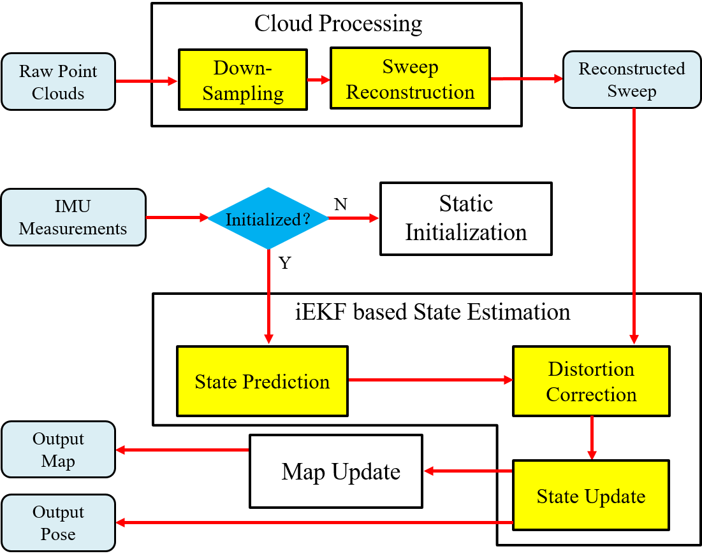

# SR-LIO 2.0

**SR-LIO 2.0** (LiDAR-Inertial Odometry with Sweep Reconstruction) is an accurate and robust iterated extended Kalman filter (iEKF) based LiDAR-inertial odometry (LIO) that can increase the execution frequency beyond the sweep frequency. It segments and reconstructs raw input sweeps from spinning LiDAR to obtain reconstructed sweeps with higher frequency. Such method can reduce the accumulative error of predicted state by reducing the time interval of IMU measurements integration for iEKF based LIO systems by using highfrequent reconstructed sweeps and in turn achieve more accurate and robust state estimation results. **Comapred with the SR-LIO 1.0, SR-LIO 2.0 can run in real time.**

## Related Work

[SR-LIO: LiDAR-Inertial Odometry with Sweep Reconstruction](https://arxiv.org/abs/2210.10424)

Authors: [*Zikang Yuan*](https://scholar.google.com/citations?hl=zh-CN&user=acxdM9gAAAAJ), [*Fengtian Lang*](https://scholar.google.com/citations?hl=zh-CN&user=zwgGSkEAAAAJ&view_op=list_works&gmla=ABEO0Yrl4-YPuowyntSYyCW760yxM5-IWkF8FGV4t9bs9qz1oWrqnlHmPdbt7LMcMDc04kl2puqRR4FaZvaCUONsX7MQhuAC6a--VS2pTsuwj-CyKgWp3iWDP2TS0I__Zui5da4), *Tianle Xu* and [*Xin Yang*](https://scholar.google.com/citations?user=lsz8OOYAAAAJ&hl=zh-CN)

**Pipeline:**
<div align="center">

</div>

**New Features:**
1. The proposed **Sweep Reconstruction** module splits the original sweep packet into continuous point cloud data streams, and then re-packages point cloud data streams in a multiplexing way to obtain sweeps with higher frequency, which is **illustrated by the figure as follow**:
<div align="center">

</div>

2. **Sweep Reconstruction** can effectively reduce the accumulative error of predicted state by reducing the time interval of IMU measurements integration for iEKF based LIO systems by using highfrequent reconstructed sweeps and in turn achieve more accurate and robust state estimation results.
3. **SR-LIO** proposes **Performing distortion correction for each segment** to prevent inaccurate trajectory caused by multiple inconsistent distortion correction to a particular point.

## Installation

### 1. Requirements

> GCC >= 5.4.0
>
> Cmake >= 3.0.2
> 
> [Eigen3](http://eigen.tuxfamily.org/index.php?title=Main_Page) >= 3.2.8
>
> [PCL](https://pointclouds.org/downloads/) == 1.7 for Ubuntu 16.04, and == 1.8 for Ubuntu 18.04
>
> [Ceres](http://ceres-solver.org/installation.html) >= 1.14
>
> [ROS](http://wiki.ros.org/ROS/Installation)

##### Have Tested On:

| OS    | GCC  | Cmake | Eigen3 | PCL | Ceres |
|:-:|:-:|:-:|:-:|:-:|:-:|
| Ubuntu 16.04 | 5.4.0  | 3.16.0 | 3.2.8 | 1.7 | 1.14 |
| Ubuntu 18.04 | 7.5.0  | 3.11.2 | 3.3.4 | 1.8 | 1.14 |

### 2. Create ROS workspace

```bash
mkdir -p ~/SR-LIO/src
cd SR-LIO/src
```

### 3. Clone the directory and build

```bash
git clone https://github.com/ZikangYuan/sr_lio.git
cd ..
catkin_make
```

## Run on Public Datasets

Noted:

A. Except fot the external parameters between IMU and LiDAR, and the value of gravitational acceleration, **the parameter configurations used in different datasets are exactly the same** to demonstrate the stability and robustness of **SR-LIO**.

B. Please make sure the LiDAR point clouds have the "ring" channel information.

C. The warning message "Failed to find match for field 'time'." doesn't matter. It can be ignored.

D. **Please create a folder named "output" before running.** When **SR-LIO** is running, the estimated pose is recorded in real time in the **pose.txt** located in the **output folder**.

E. If you want to get some visualization of the split and recombine, please set the **debug_output** parameter in the launch file to 1 (true). After that, you can get some .pcd files in **"output/cloud_frame"** and **"output/cut_sweep"** folders.

F. As the groundtruth acquisition of some datasets (*UTBM* and *ULHK*) are extremely complicated, in order to facilitate evaluation, **we store the pose ground truth of the three datasets used by us as [TUM](https://vision.in.tum.de/data/datasets/rgbd-dataset) format. Please down load from [Google drive](https://drive.google.com/drive/folders/1WnvzUzP_s70p4myPf5fsP1Jtr_62PnL1)**.

###  1. Run on [*NCLT*](http://robots.engin.umich.edu/nclt/)

The time for finishing a sweep by the LiDAR of *NCLT* is not 100ms, but 130~140ms (around 7.5 Hz). Therefore, we need to package the data stream of the *NCLT* dataset as 7.5 Hz sweep packages. The **nclt_to_rosbag.py** in the **"tools"** folder can be used to package 7.5 Hz sweeps and linearly interpolated 100 Hz IMU data into a rosbag file:

```bash
python3 nclt_to_rosbag.py PATH_OF_NVLT_SEQUENCE_FOLDER PATH_OF_OUTPUT_BAG
```

Then, please go to the workspace of **SR-LIO** and type:

```bash
cd SR-LIO
source devel/setup.bash
roslaunch sr_lio lio_nclt.launch
```

Then open the terminal in the path of the bag file, and type:

```bash
rosbag play SEQUENCE_NAME.bag --clock -d 1.0
```

### 2. Run on [*UTBM*](https://epan-utbm.github.io/utbm_robocar_dataset/#Downloads)

Before evaluating on *UTBM* dataset, a dependency needs to be installed. If your OS are Ubuntu 16.04, please type:

```bash
sudo apt-get install ros-kinetic-velodyne 
```

If your OS are Ubuntu 18.04, please type:

```bash
sudo apt-get install ros-melodic-velodyne 
```

Then open the terminal in the path of **SR-LIO**, and type:

```bash
source devel/setup.bash
roslaunch sr_lio lio_utbm.launch
```

Then open the terminal in the path of the bag file, and type:

```bash
rosbag play SEQUENCE_NAME.bag --clock -d 1.0
```

### 3. Run on [*ULHK*](https://github.com/weisongwen/UrbanLoco)

For sequence *HK-Data-2019-01-17* and *HK-Data-2019-03-17*, the imu data does not include the gravity acceleration component, and the topic of LiDAR point cloud data is */velodyne_points_0*. For other sequences of *ULHK* used by us, the imu data includes the gravity acceleration component, and the topic of LiDAR point cloud data is */velodyne_points*. Therefore, we provide two launch files for the *ULHK* dataset.

If you test **SR-LIO** on *HK-Data-2019-01-17* or *HK-Data-2019-03-17*, please type:

```bash
source devel/setup.bash
roslaunch sr_lio lio_ulhk1.launch
```

If you test **SR-LIO** on *HK-Data-2019-03-16-1*, *HK-Data-2019-04-26-1* or *HK-Data-2019-04-26-2*, please type:

```bash
sourcr devel/setup.bash
roslaunch sr_lio lio_ulhk2.launch
```

Then open the terminal in the path of the bag file, and type:

```bash
rosbag play SEQUENCE_NAME.bag --clock -d 1.0
```

### 4. Run on [*KAIST*](https://sites.google.com/view/complex-urban-dataset)

For point clouds, we utilize the data from both two 3D LiDARs of *KAIST*. Users can package the rosbag according to the tool [kaist2bag](https://github.com/ZikangYuan/kaist2bag). The partial test sequences of *KAIST* used by us can also be downloaded from [Google drive](https://drive.google.com/drive/folders/1upQuR9cWoawM6MuPYxSpPQPlRLK7sDWU). 

Chinese users can download the test sequences of *KAIST* form [baidu yun](https://pan.baidu.com/s/1vrat2HdTf6NBrjw_kGCZNw), while the password is **s4bw**.

Please go to the workspace of **SR-LIO** and type:

```bash
source devel/setup.bash
roslaunch sr_lio lio_kaist.launch
```

Then open the terminal in the path of the bag file, and type:

```bash
rosbag play SEQUENCE_NAME.bag --clock -d 1.0
```

## Citation

If you use our work in your research project, please consider citing:

```
@article{yuan2022sr,
  title={SR-LIO: LiDAR-Inertial Odometry with Sweep Reconstruction},
  author={Yuan, Zikang and Lang, Fengtian and Yang, Xin},
  journal={arXiv preprint arXiv:2210.10424},
  year={2022}
}
```

## Acknowledgments

Thanks for [CT-ICP](https://github.com/jedeschaud/ct_icp), [Fast-LIO](https://github.com/hku-mars/FAST_LIO), [VINs-Mono](https://github.com/HKUST-Aerial-Robotics/VINS-Mono) and [Open-VINs](https://github.com/vell001/open_vins).
