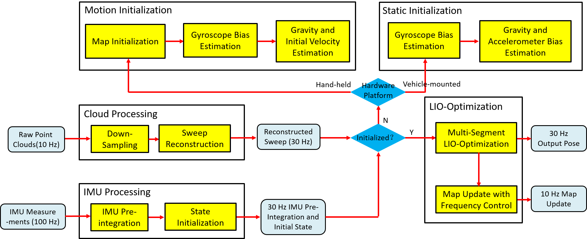
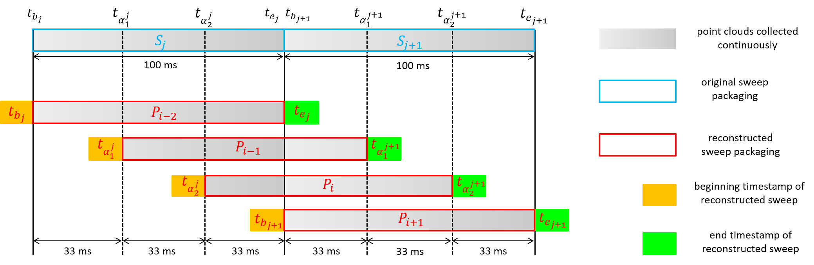

# SR-LIO
**SR-LIO** (LiDAR-Inertial Odometry with Sweep Reconstruction) is a accurate and robust LiDAR-inertial odometry (LIO) package that can adjust the execution frequency beyond the sweep frequency. It segments and reconstructs raw input sweeps from spinning LiDAR to obtain reconstructed sweeps with higher frequency for shortening the time period of IMU pre-integration, so as to reduce the error of IMU preintegration. The main contributions of our package are as follow:
1. We propose a sweep reconstruction method, which can increase the frequency of spinning LiDAR sweeps and reduce the error of IMU pre-integration in LIO systems;
2. We embed the proposed sweep reconstruction method into our newly designed BA based LIO system and achieve the stateof-the-art accuracy;

## Related Works


## Demo Video (2022-10-17 Update)

The **x15 Real-Time Performance** on sequence *nclt_2013-01-10* (left), and the **Resulted Global Map and Trajectory** on sequence *nclt_2013-01-10* (right). It is important to emphasize that **"x15" is the multiplier relative to the 10 Hz raw input LiDAR sweep**, not relative to the processing frequency of our system. On our currently hardware platform (**Intel Core i7-12700 and 32 GB RAM**), SR-LIO cannot run in real-time after the raw input LiDAR sweeps are reconstructed from 10 Hz to 30 Hz.

<div align="left">


</div>

**Related video:**: [Real-Time Performance](https://youtu.be/KYGFNe-8On4), [Global Map and Trajectory](https://youtu.be/7XpBDc41uUA)

**Pipeline:**
<div align="center">

</div>

**New Features:**
1. The proposed **Sweep Reconstruction** module splits the original sweep packet into continuous point cloud data streams, and then re-packages point cloud data streams in a multiplexing way to obtain sweeps with higher frequency, which is **illustrated by the figure as follow**:
<div align="center">

</div>

2. **Sweep Reconstruction** can effectively reduce the time interval for each IMU pre-integration, reducing the IMU pre-integration error and enabling the usage of BA based LiDAR-inertial optimization.
3. Following [CT-ICP](https://github.com/jedeschaud/ct_icp), **SR-LIO** represents the state of two moments in each sweep: 1) at the beginning time of a sweep, and 2) at the end time of the sweep.
4. **SR-LIO** proposes **Multi-Segment LIO Optimization** for equally optimize all state variables during the period of a reconstructed sweep.
5. All details about the Jacobian matrixes are available in the appendix of our article.

## Installation

### Requirements

> GCC >= 5.4.0
>
> Cmake >= 3.0.2
> 
> [Eigen3](http://eigen.tuxfamily.org/index.php?title=Main_Page) >= 3.2.8
>
> [PCL](https://pointclouds.org/downloads/) == 1.7 for Ubuntu 16.04, and == 1.8 for Ubuntu 18.04
>
> [Ceres](http://ceres-solver.org/installation.html) >= 1.14

##### Have Tested On:

| OS    | GCC  | Cmake | Eigen3 | PCL | Ceres |
| ----- | ---- | ----- | ------ | --- | ----- |
| Ubuntu 16.04 | 5.4.0  | 3.16.0 | 3.2.8 | 1.7 | 1.14 |
| Ubuntu 18.04 | 7.5.0  | 3.11.2 | 3.3.4 | 1.8 | 1.14 |

### Step 0: Create ROS workspace

```bash
mkdir -p ~/SR-LIO/src
cd SR-LIO
```

### Step 1: Clone the directory and build

```bash
git clone https://github.com/ZikangYuan/sr_lio.git
catkin_make
sourcr devel/setup.bash
```
